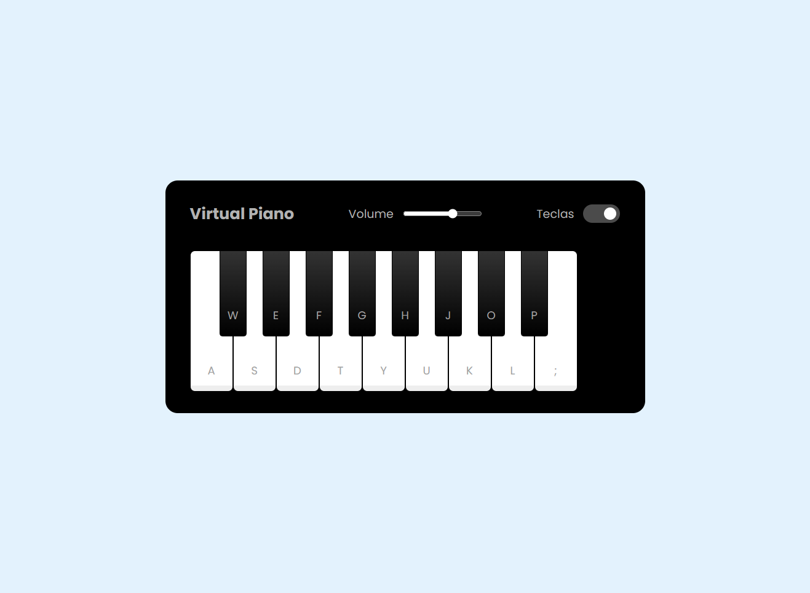

<h1 align="center">VIRTUAL KEYBOARD</h1>

  

## 🚀 Tecnologias

Esse projeto foi desenvolvido com as seguintes tecnologias:

- HTML e CSS
- JavaScript 
- Git e Github

## 💻 Projeto
Criado um projeto Web de um simulador de piano utilizando apenas JavaScript para dar lógica ao nosso mini game.

## :memo: Licença